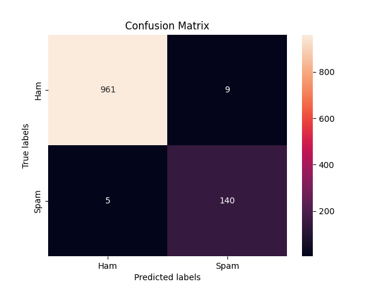

# spamClassifier

Spam detection with the preprocessing techniques of **stopwords**, **stemming** and vectorizing by **Bag of Words**.  
**Naive Bayes** classifier is used to train the model  

## Result
_Accuracy : 0.9874439461883409_  

Confusion Matrix :  

